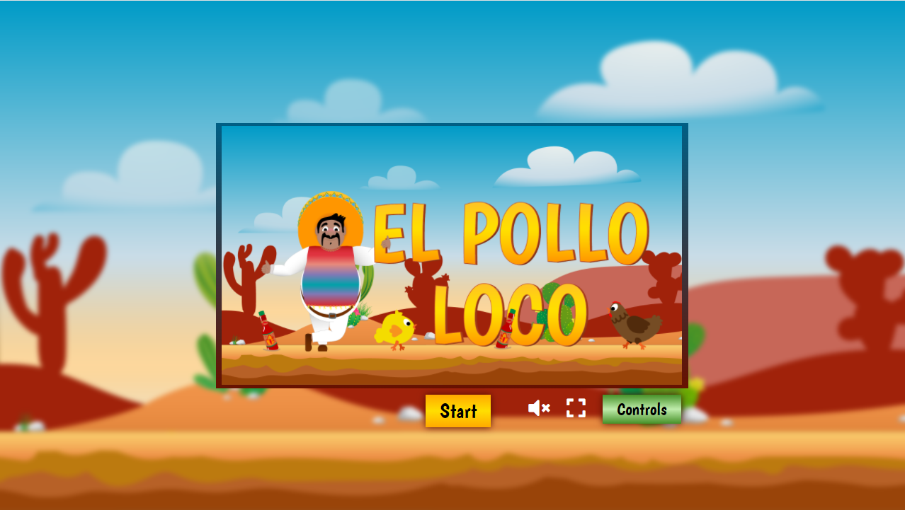
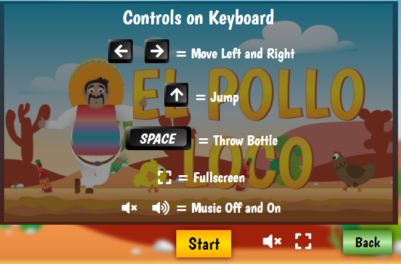
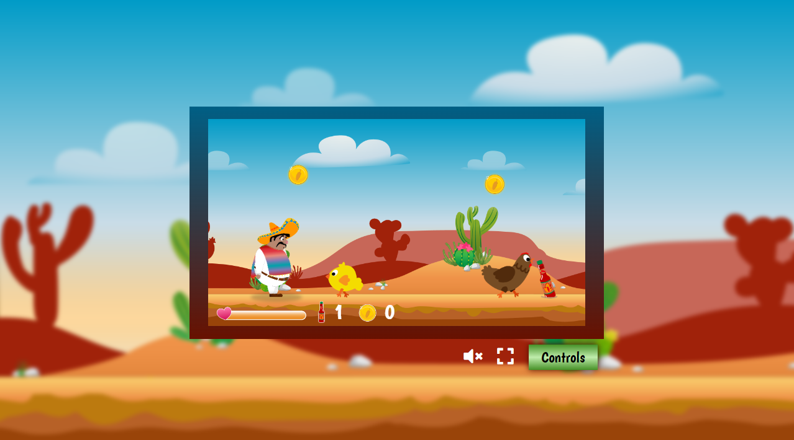
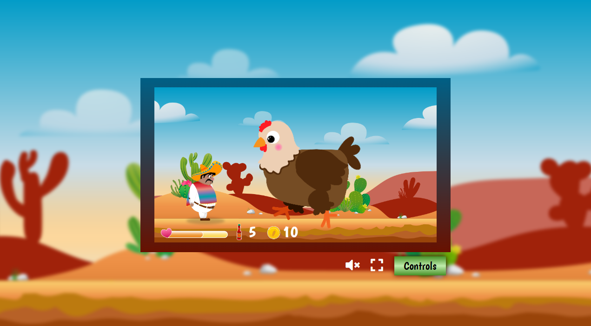
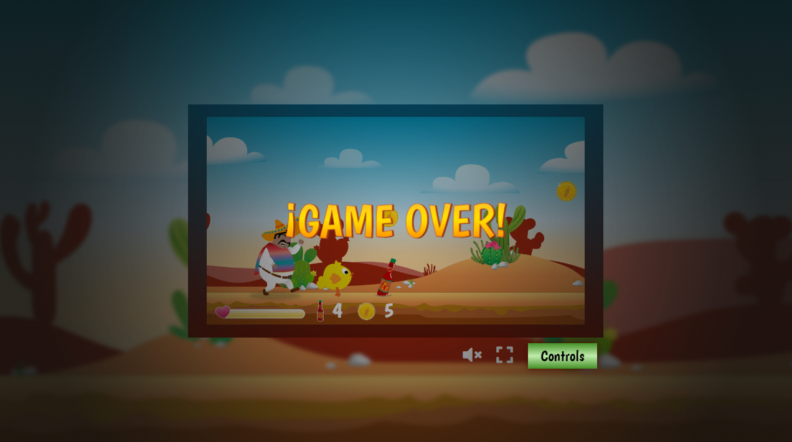

# El-Pollo-Loco
Pepe is attacked by angry little chicken and he has to jump on it
to destroy them.\
At the the End El-Pollo-Loco is coming and want to kill 
Pepe. He has to throw Bottles at him to kill it and 
save the World.\
Test the Game: http://bastian-harttung.developerakademie.com/El-Pollo-Loco/index.html

A nice funny Game written in JavaScript

### Start
- Start Game by clicking Start.
- Stop Music
- Big Screen
- Watch Controls

### Controls
- Move Left and Right with Arrow-Keys
- Jump with Arrow-Up
- Throw Bottle with Space after picking up

### Game
- Jump on the little Chicken with Arrow-Up
- Collect Coins and Bottles
- You see your Life, Bottles and Coins in Status Bar

### Endboss
- You have to throw Bottles at him to kill him
- Beware of him. He gets very wild.

### Game-Over
- If your Life-Bar comes to End you die

